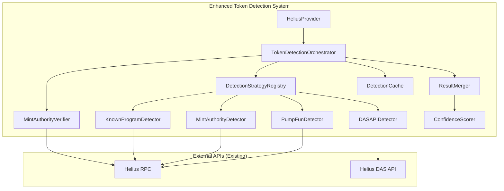

# Design Document: Solana Wallet Detection Improvements

## Overview

This design enhances the existing Solana token detection system in `HeliusProvider` to improve accuracy from ~85-90% to ~95%+ reliability. The improvements focus on:

1. Stricter Pump.fun token creation detection using verified on-chain data
2. Extended transaction scanning with pagination (up to 4000 transactions)
3. Universal InitializeMint detection across all programs
4. Confidence scoring for detection results
5. Efficient caching with LRU eviction
6. Elimination of false positives through mint authority verification

The design extends the existing `HeliusProvider` class rather than replacing it, maintaining backward compatibility.

## Architecture

The enhanced detection system adds new components while preserving the existing `HeliusProvider` structure:



## Components and Interfaces

### 1. DetectionStrategy Interface

New interface for pluggable detection strategies:

```typescript
interface DetectionStrategy {
  name: string;
  priority: number;
  confidenceBase: number;
  
  detect(
    walletAddress: string,
    options: DetectionOptions
  ): Promise<DetectedToken[]>;
}

interface DetectionOptions {
  maxTransactions: number;
  timeoutMs: number;
  beforeSignature?: string;
}

interface DetectedToken {
  token: string;
  name?: string;
  symbol?: string;
  launchAt?: string;
  detectionMethod: DetectionMethod;
  mintAuthorityVerified: boolean;
  rawConfidence: number;
}

type DetectionMethod = 
  | 'mint_authority_verified'
  | 'das_api_authority'
  | 'pump_fun_create'
  | 'known_program'
  | 'heuristic';
```

### 2. TokenDetectionOrchestrator

New class that coordinates all detection strategies:

```typescript
interface TokenDetectionOrchestrator {
  registerStrategy(strategy: DetectionStrategy): void;
  
  detectTokens(
    walletAddress: string,
    options?: Partial<DetectionOptions>
  ): Promise<DetectionResult>;
}

interface DetectionResult {
  tokens: EnrichedTokenSummary[];
  scanMetadata: ScanMetadata;
}

interface ScanMetadata {
  transactionsScanned: number;
  totalTransactionsAvailable: number;
  scanComplete: boolean;
  scanDurationMs: number;
  methodsUsed: DetectionMethod[];
}
```

### 3. EnrichedTokenSummary

Extended TokenSummary with detection metadata:

```typescript
interface EnrichedTokenSummary extends TokenSummary {
  confidenceScore: number;           // 0-100
  detectionMethod: DetectionMethod;
  verificationStatus: 'verified' | 'unverified' | 'failed';
  exclusionReason?: string;          // For debugging failed verifications
}
```

### 4. MintAuthorityVerifier

Verifies token creation by checking on-chain mint authority data:

```typescript
interface MintAuthorityVerifier {
  verify(
    tokenMint: string,
    walletAddress: string
  ): Promise<VerificationResult>;
}

interface VerificationResult {
  isCreator: boolean;
  mintAuthority: string | null;
  verificationMethod: 'on_chain' | 'transaction_history';
  confidence: number;
  reason?: string;
}
```

### 5. DetectionCache

LRU cache for detection results:

```typescript
interface DetectionCache {
  get(walletAddress: string): CachedResult | null;
  set(walletAddress: string, result: DetectionResult, ttl?: number): void;
  invalidate(walletAddress: string): void;
  getStats(): CacheStats;
}

interface CachedResult {
  result: DetectionResult;
  cachedAt: number;
  expiresAt: number;
}

interface CacheConfig {
  defaultTtlMs: number;  // Default: 5 minutes
  maxEntries: number;    // Default: 100
}
```

### 6. ConfidenceScorer

Calculates confidence scores based on detection method:

```typescript
interface ConfidenceScorer {
  calculateScore(token: DetectedToken): number;
  sortByConfidence(tokens: EnrichedTokenSummary[]): EnrichedTokenSummary[];
}

const CONFIDENCE_SCORES = {
  mint_authority_verified: 100,
  das_api_authority: 95,
  pump_fun_create: 90,
  known_program: 85,
  heuristic_high: 80,
  heuristic_medium: 70,
  heuristic_low: 60,
};
```

## Data Models

### Transaction Scan State

```typescript
interface ScanState {
  walletAddress: string;
  startTime: number;
  transactionsScanned: number;
  lastSignature?: string;
  tokensFound: Map<string, DetectedToken>;
  errors: ScanError[];
}

interface ScanError {
  method: DetectionMethod;
  error: string;
  timestamp: number;
}
```

### Scan Limits Configuration

```typescript
const SCAN_LIMITS = {
  maxTransactions: 4000,
  timeoutMs: 90000,  // 90 seconds
  batchSize: 100,
  delayBetweenBatches: 100,  // ms
};
```


## Correctness Properties

*A property is a characteristic or behavior that should hold true across all valid executions of a system-essentially, a formal statement about what the system should do. Properties serve as the bridge between human-readable specifications and machine-verifiable correctness guarantees.*

Based on the prework analysis, the following correctness properties have been identified. Redundant properties have been consolidated.

### Property 1: Pump.fun Creation vs Purchase Distinction
*For any* Pump.fun transaction, the Token Detection System SHALL correctly classify it as a creation only if it contains an InitializeMint instruction with the wallet as mint authority, and SHALL NOT classify token transfers without mint authority as creations.
**Validates: Requirements 1.1, 1.2, 1.3**

### Property 2: Token Metadata Extraction
*For any* detected Pump.fun token, the returned result SHALL include name, symbol, and creation timestamp fields.
**Validates: Requirements 1.4**

### Property 3: Transaction Scan Limits
*For any* wallet scan, the system SHALL scan at most 4000 transactions and terminate within 90 seconds, returning partial results with appropriate flags when limits are reached.
**Validates: Requirements 2.1, 2.2, 2.3, 2.4**

### Property 4: Universal InitializeMint Detection
*For any* transaction containing InitializeMint or InitializeMint2 instructions where the wallet is mint authority, the system SHALL detect and classify the token as created, regardless of the invoking program.
**Validates: Requirements 3.1, 3.2**

### Property 5: Detection Method Recording
*For any* token detected via InitializeMint verification, the detection method SHALL be recorded as "mint_authority_verified".
**Validates: Requirements 3.3**

### Property 6: Deduplication with Method Preference
*For any* token detected by multiple methods, the system SHALL return exactly one result preferring the most reliable detection method (mint_authority_verified > das_api_authority > pump_fun_create > known_program > heuristic).
**Validates: Requirements 3.4**

### Property 7: Confidence Score Validity
*For any* detected token, the confidence score SHALL be between 0 and 100, with mint_authority_verified = 100, das_api_authority = 95, and heuristic methods between 60-80.
**Validates: Requirements 4.1, 4.2, 4.3, 4.4**

### Property 8: Confidence-Based Sorting
*For any* detection result set, tokens SHALL be sorted by confidence score in descending order.
**Validates: Requirements 4.5**

### Property 9: Cache Behavior
*For any* completed wallet analysis, results SHALL be cached with configurable TTL, cache hits SHALL return without re-scanning, force refresh SHALL bypass cache, and LRU eviction SHALL occur when max entries exceeded.
**Validates: Requirements 5.1, 5.2, 5.3, 5.4**

### Property 10: False Positive Prevention
*For any* token, the system SHALL require verified mint authority evidence before classification, SHALL NOT classify transferred tokens as created, and SHALL exclude tokens with failed or inconclusive verification.
**Validates: Requirements 6.1, 6.2, 6.3, 6.4**

### Property 11: Exclusion Logging
*For any* token excluded due to failed verification, the system SHALL log the exclusion reason.
**Validates: Requirements 6.5**

### Property 12: Strategy Execution
*For any* detection run, the system SHALL execute all registered detection strategies and merge their results.
**Validates: Requirements 7.3**

### Property 13: Serialization Round Trip
*For any* valid DetectionResult object, serializing to JSON and deserializing back SHALL produce an equivalent object.
**Validates: Requirements 7.4**

## Error Handling

### API Errors
- Network failures: Retry with exponential backoff (existing RETRY_CONFIG)
- Rate limiting: Respect existing RATE_LIMIT_DELAY_MS (200ms)
- Invalid responses: Log and continue with other detection methods

### Verification Failures
- On-chain verification failure: Mark as unverified, exclude from results
- Timeout during verification: Mark as inconclusive, exclude from results
- Log all exclusions with reasons for debugging

### Scan Limits
- Transaction limit reached: Return partial results with `scanComplete: false`
- Timeout reached: Return partial results with `scanComplete: false`
- Include `transactionsScanned` and `totalTransactionsAvailable` in metadata

## Testing Strategy

### Property-Based Testing Library
Use `fast-check` for property-based testing in TypeScript.

### Unit Tests
- Test individual detection strategies in isolation
- Test confidence scoring calculations
- Test cache operations (get, set, invalidate, eviction)
- Test result merging and deduplication

### Property-Based Tests
Each correctness property will have a corresponding property-based test:
- Generate random wallet addresses and transaction data
- Verify properties hold across all generated inputs
- Configure minimum 100 iterations per property test
- Tag each test with format: `**Feature: solana-wallet-detection-improvements, Property {number}: {property_text}**`

### Integration Tests
- Test full detection flow with mocked API responses
- Test cache integration with detection orchestrator
- Test timeout and limit handling

### Test Data Generation
- Generate valid Solana addresses (base58, 32-44 chars)
- Generate mock transactions with various instruction types
- Generate mock DAS API responses
- Generate edge cases: empty results, partial data, errors
